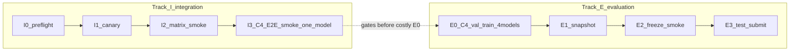

# Handoff: GAIA test-split evaluation — 16-cell matrix on the HKU CS GPU farm

**Session date:** 2026-04-18 (matrix protocol); **doc refresh:** 2026-04-19
**Branch / HEAD push:** `main` at `e94f571` (includes `463d791` 16-cell smoke / `validate_handoffs` + handoff doc sync)
**Scope:** Executes the GAIA submission run for the APAI4799 meta-agent paper.
Produces **4 models × 4 conditions = 16 `dra.jsonl` files** on the GAIA test
split (~300 questions each; ~4,800 Q total), plus the C4 training pass
needed to harden the skill library before the scored evaluation.

> **Matrix-size update (2026-04-18):** expanded from 12 cells to 16 after
> handoff #9 landed (D4 added Gemma-4-31B as the 4th model slot). Cost +~$10-35
> on the full test-split run vs the old 12-cell budget.

**Dependencies:**
- [`HANDOFF_SILENT_FAILURES.md`](HANDOFF_SILENT_FAILURES.md) (`ba28f21`) — browser/analyzer silent-fail fixes
- [`HANDOFF_PROVIDER_MATRIX.md`](HANDOFF_PROVIDER_MATRIX.md) (`7632470` → `9883a3a`) — Mistral / Kimi / Qwen registration + failover
- [`HANDOFF_MODIFY_SUBAGENT_GUIDANCE.md`](HANDOFF_MODIFY_SUBAGENT_GUIDANCE.md) (`764c6bf` → `b73eb39`) — C2+ prompt expansions
- [`HANDOFF_C3_C4_IMPLEMENTATION.md`](HANDOFF_C3_C4_IMPLEMENTATION.md) (`60065a8` → `d247605`) — ReviewStep + Skill library
- [`HANDOFF_RC1_FINAL_ANSWER_GUARD.md`](HANDOFF_RC1_FINAL_ANSWER_GUARD.md) (`54e7707` → `d36f4d4`) — RC1/RC2 guards
- [`HANDOFF_TOOLGENERATOR.md`](HANDOFF_TOOLGENERATOR.md) (`0161321` → `7ee9ae1`) — ToolGenerator hardening

Plus the 2026-04-18 local-validation follow-ups listed in
[`HANDOFF_INDEX.md`](../../HANDOFF_INDEX.md): `a98da9a`, `7ee9ae1`, `905a1fa`,
`4162bcc`, `0e7903c`, `c2fd507`, `6f5ddd1`, and this session's Qwen-swap commit.
**2026-04-19:** `463d791` — `smoke_validate_handoffs_234.sh` and `validate_handoffs.sh`
include **Gemma** (16-cell grep matrix); see index **Progress snapshot**.

---

## Glossary — splits, caps, official score, C4 extraction

| Term | Meaning |
|------|---------|
| **Integration track (I0–I3)** | “Does it run?” — cheap gates on validation smoke, configs, keys, and (optionally) the C4 train→snapshot→freeze *mechanism* for one model. |
| **Evaluation track (E0–E3)** | “What is the GAIA **test** score?” — full validation C4 training for four models, snapshot, farm freeze check, then **test-split** 16-cell submission. |
| **`dataset.split`** | In **full mode** `DATASET_SPLIT` is **required** and enforced by [`scripts/run_eval_matrix.sh`](../../scripts/run_eval_matrix.sh) — no implicit default, no escape hatch. Rules: **C4 in conditions ⇒ `validation`** (C4 trains here; test would be train-on-test leakage); **C0/C2/C3 alone ⇒ `test`** (reported scores are always on test). Both catastrophic misconfigs (`full '' c4` on test, `full '' c0` on validation) refuse to launch. Smoke mode is unaffected — always validation with `max_samples` cap. |
| **Official paper score** | Accuracy from **E3** `dra.jsonl` on the **test** split, after **E0–E2** for any reported frozen-library C4 numbers. |
| **C4 extraction ON** | Default in generated C4 configs; **I3a**, **I2** C4 cell, **E0** training. Mutates `skills_dir` during the run. |
| **C4 extraction OFF** | Achieved via `--cfg-options agent_config.enable_skill_extraction=False` plus a pinned `agent_config.skills_dir` (snapshot). **I3c**, **E2**, **E3** C4 cells. |
| **Smoke step caps** | `SMOKE_CFG_OPTIONS` in [`scripts/run_eval_matrix.sh`](../../scripts/run_eval_matrix.sh) (and the same defaults in [`scripts/integration_i3_c4_pipeline.sh`](../../scripts/integration_i3_c4_pipeline.sh)); **not** for E3. |
| **`validate_handoffs.sh`** | Greps the **16-cell matrix** `workdir/gaia_*_<DRA_RUN_ID>/` layout from **I2 / E3** — it does **not** validate **I3** artifacts (`workdir/c4_i3_*`); I3 is a separate cheap C4 pipeline smoke. |

**Legacy aliases:** former **S0–S2** = **I0–I2**; former **S4** test submit = **E3**. “Post-S2 snapshot” in older notes = **E1 — snapshot after E0**.



| Step | Role | Primary command |
|------|------|-----------------|
| **I0** | Preflight | `bash scripts/smoke_validate_handoffs_234.sh` |
| **I1** | Single-cell canary | `sbatch run_matrix_slurm.sh smoke mistral c0` |
| **I2** | 16-cell integration smoke | `sbatch run_matrix_slurm.sh smoke` |
| **I3** | C4 E2E integration (subset → snapshot → few Q, **one model**, default Mistral) | `bash scripts/integration_i3_c4_pipeline.sh` |
| **E0** | C4 val train (full val, **four** models) | `DATASET_SPLIT=validation sbatch --export=ALL run_matrix_slurm.sh full '' c4` |
| **E1** | Snapshot trained `skills/` after E0 | `cp -a` loop → `workdir/c4_trained_libraries/{model}_skills` |
| **E2** | Farm freeze smoke (four models, real libraries) | per-model `sbatch` loop with `agent_config.*` overrides |
| **E3** | Test-split submission (16 cells) | `DATASET_SPLIT=test sbatch --export=ALL run_matrix_slurm.sh full '' {c0,c2,c3}` (one per condition — matrix runner refuses the all-4-conditions shape on test to prevent C4 train-on-test) + per-model frozen C4 via `examples/run_gaia.py` with `agent_config.enable_skill_extraction=False` |

---

## TL;DR Checklist

### Before the farm

- [ ] `git pull origin main` → HEAD includes this session's Qwen-swap commit
- [ ] `.env` populated on farm with: `MISTRAL_API_KEY`, `OPENROUTER_API_KEY`,
      `FIRECRAWL_API_KEY`, **`HF_TOKEN`** (required — GAIA is a gated dataset)
- [ ] `DASHSCOPE_API_KEY` / `MOONSHOT_API_KEY` can be placeholders —
      **Kimi uses `or-kimi-k2.5`** (OpenRouter, with
      `extra_body.thinking=disabled + provider.order=[Moonshot]`),
      **Qwen uses `or-qwen3.6-plus`** (OpenRouter; hybrid `tool_choice`
      dispatch resolves to `"auto"` per the Qwen-family prefix rule),
      **Gemma uses `or-gemma-4-31b-it`** (OpenRouter paid; provider pin
      `DeepInfra+Together`, `reasoning.enabled=false`, per-stream
      concurrency capped at 4)
- [ ] `OPENAI_API_KEY` optional — `ModelManager` short-circuits on empty
- [ ] Pull the GAIA dataset once into `data/GAIA/` (see "Prerequisites" below)

### On the farm

- [ ] **I0** pre-flight: `bash scripts/smoke_validate_handoffs_234.sh`
- [ ] **I1** single-cell canary: `sbatch run_matrix_slurm.sh smoke mistral c0`
- [ ] **I2** smoke matrix: `sbatch run_matrix_slurm.sh smoke` (default **3 Q/cell** + smoke step caps; **4 models in parallel**)
- [ ] **I3** (optional, recommended when C4 code/config changes): `bash scripts/integration_i3_c4_pipeline.sh` — one-model C4 subset train → snapshot → freeze few-Q smoke under `workdir/c4_i3_*` (does not touch `c4_trained_libraries/`)
- [ ] **E0** C4 validation training (see §E0 — C4 val train) — **required** before scored **C4** on `test` (four parallel model jobs)
- [ ] **E1 — snapshot after E0** — `cp -a` each C4 `skills/` into
      `workdir/c4_trained_libraries/{model}_skills` (§E0 / §E1)
- [ ] **E2** farm-side freeze smoke (~30 min): 3-Q × 4 models, `agent_config.*` freeze overrides
- [ ] **E3** test-split submission: one `DATASET_SPLIT=test sbatch --export=ALL run_matrix_slurm.sh full '' <cN>` per C0/C2/C3, plus per-model frozen C4 via `examples/run_gaia.py` (see §E3). The matrix runner refuses the all-4-conditions shape on test by design.
- [ ] Collect `dra.jsonl` → run `scripts/analyze_results.py` per cell
- [ ] `bash scripts/validate_handoffs.sh <DRA_RUN_ID>` → attach pass/info
      summary to this handoff when promoting to Completed
- [ ] **Retain** all `workdir/gaia_*`, `workdir/run_logs/`, and `logs/matrix_*.out` until reviewed/archived (§Output retention)

---

## Matrix definition

16 cells = 4 models × 4 conditions:

| Condition | Meta-agent capability added | Configs / model slot |
|-----------|------------------------------|----------------------|
| **C0** | — (vanilla `PlanningAgent` baseline) | `configs/config_gaia_c0_<model>.py` |
| **C2** | Reactive `diagnose_subagent` + `modify_subagent` | `configs/config_gaia_c2_<model>.py` |
| **C3** | C2 + structural REVIEW step | `configs/config_gaia_c3_<model>.py` |
| **C4** | C3 + cross-task skill library (pre-seeded + learned) | `configs/config_gaia_c4_<model>.py` |

| Model slot | Real slug (model_id) | Cost (in/out /M) | tool_choice handling | Rationale / caveats |
|------------|----------------------|-------------------|-----------------------|---------------------|
| **Mistral** | `mistral-small` (native La Plateforme) | $0.15 / $0.60 | `"required"` works | Dense ~24B; uses `MISTRAL_API_KEY`. |
| **Kimi** | `or-kimi-k2.5` (OpenRouter) | free tier | `"required"` works after extra_body fix (thinking off) | `extra_body={thinking: disabled, provider.order: [Moonshot]}` pins routing so free-tier OR can't silently fall back to a sub-provider with diverging thinking semantics. Enables vision on GAIA image questions. |
| **Qwen** | `or-qwen3.6-plus` (OpenRouter, D1) | $0.325 / $1.95 | **hybrid dispatch → "auto"** (Qwen-family prefix rule, D3) | Vision + 1M context. OR providers for the whole Qwen family reject `"required"`; hybrid dispatch + retry guard coax plain-text replies back into tool calls. |
| **Gemma** (D4) | `or-gemma-4-31b-it` (OpenRouter paid) | $0.13 / $0.38 | `"required"` works directly (verified 2026-04-18) | Dense 31B, Apache 2.0, only non-MoE in the matrix. Provider pin `DeepInfra+Together` + `reasoning.enabled=false`; `:free` variant excluded (Google AI Studio lacks reliable `tools` + `required`). Per-stream concurrency capped at 4 (vLLM #39392 pad-parser bug). |

### Browser step cap policy (2026-04-19)

All 16 matrix configs set `auto_browser_use_tool_config.max_steps=15`
(down from the `AutoBrowserUseTool` class default of 50). Fixed in the
generator template (`scripts/gen_eval_configs.py`), so any regeneration
inherits it.

**Why 15, not 50:** typical GAIA browser flows terminate in 2–12 internal
steps; the 20+ step tail is dominated by **stuck loops** — CAPTCHA
retries ("still seeing CAPTCHA" evals, confirmed on Mac 2026-04-18, 25+
wasted steps in one invocation), cookie-modal fights, infinite scroll
hunts. A single stuck 50-step invocation burns ~$0.10–1.00 depending on
model and 8–12 min wall; cap at 15 bounds it to ~$0.05 and ≤4 min.

**Why uniform across all 16 cells:** different browser budgets per
condition would contaminate the C0/C2/C3/C4 accuracy deltas the paper is
measuring. All cells share the same ceiling so condition differences
reflect meta-agent capability, not browser headroom.

**Local smoke override:** I-track (`SMOKE_CFG_OPTIONS` default in both
[`scripts/run_eval_matrix.sh`](../../scripts/run_eval_matrix.sh) and
[`scripts/integration_i3_c4_pipeline.sh`](../../scripts/integration_i3_c4_pipeline.sh))
now ships `auto_browser_use_tool_config.max_steps=4` plus tighter planner
(`agent_config.max_steps=6`) and browser sub-agent (`browser_use_agent_config.max_steps=2`)
caps — per-cell wall drops from ~5-10 min to ~1-3 min on stuck-browser
questions. Smoke is "does it run?" not "is it accurate?", so the tighter
ceiling is fine. Override via `export SMOKE_CFG_OPTIONS="..."` before invoking.
Farm-side freeze smoke (**E2**) uses the per-model sbatch wrapper with its
own explicit overrides.

**If Gemma / Qwen accuracy turns out to be bottlenecked by the cap** on
**I2** smoke evidence, raise to 20 via generator re-run + commit; do **not**
hand-edit per-cell configs (they will be overwritten on next regen).

---

## Prerequisites

```bash
ssh gpu2gate1.cs.hku.hk                        # HKU CS Phase-2 gateway
cd /userhome/cs2/ambr0se/DeepResearchMetaAgent
git pull origin main                           # ensure HEAD has this handoff's commits

conda activate dra                             # must already exist; if not, run `make install-requirements`
bash scripts/ensure_playwright_browsers.sh     # browser_use_agent needs Chromium

# GAIA dataset (one-time; ~200 MB)
python -c "
from huggingface_hub import snapshot_download
import os
snapshot_download(repo_id='gaia-benchmark/GAIA',
                  repo_type='dataset',
                  local_dir='data/GAIA',
                  token=os.environ['HF_TOKEN'])"
ls data/GAIA  # should contain 2023/ with validation + test subdirs
```

---

## Execution protocol (staged; each gate must pass before the next)

### Full chain through **E3** (final objective)

Earlier summaries sometimes collapsed **I2 → E3** or **S2 → S4**. The **complete** path for publishable, non-contaminated **C4** results is:

**Integration (I-track)** — prove the stack runs before spending on evaluation:

1. **I0 → I1 → I2** — preflight, canary, then **all 16 cells** on a **short** validation smoke (default **3 Q/cell** + smoke step caps; **four model streams in parallel** — see [`scripts/run_eval_matrix.sh`](../../scripts/run_eval_matrix.sh)).
2. **I3** (optional but recommended when C4 code/config changes) — [`scripts/integration_i3_c4_pipeline.sh`](../../scripts/integration_i3_c4_pipeline.sh): one default model (**Mistral**), subset validation train → isolated snapshot under `workdir/c4_i3_*` → short frozen eval; **does not** replace I2 and **does not** populate `c4_trained_libraries/`.

**Evaluation (E-track)** — three **named** production steps for C4 prep (not merged into one opaque command — auditability):

3. **E0** — **C4 × all four models** with extraction **on** on the **full validation split** (`DATASET_SPLIT=validation`; **not** the config default `test` from [`configs/config_gaia.py`](../../configs/config_gaia.py)), so each model’s library learns only from **validation** before any **test** scoring.
4. **E1 — snapshot after E0** — copy each model’s trained `skills/` tree into `workdir/c4_trained_libraries/{mistral,kimi,qwen,gemma}_skills/` (see §E0 below).
5. **E2 — farm-side freeze smoke** — short validation jobs with **`agent_config.*` overrides** only (`skills_dir` snapshot + `enable_skill_extraction=False` + smoke caps); confirms extractor off and snapshot pinning on **farm** hardware against **real** trained libraries. **I3** validates the **mechanism** cheaply on one model; **E2** validates farm + four-model snapshots.
6. **E3** — **full test-split** matrix (16 cells). **C4** cells must use the **frozen** snapshot + `enable_skill_extraction=False` overrides (§E3). This is the **final scored objective** once steps **3–5** pass.

Skipping **E0–E2** while still running **C4 on `test`** leaves order-dependent, extraction-on scoring (the failure mode §E0 explains). If you only need C0–C3 for a milestone, you can defer **E0–E2**, but any **C4 test-split claim** should complete **I0–I2** plus **E0–E3** as appropriate.

### Output retention

**Do not delete** `workdir/gaia_*_<DRA_RUN_ID>/`, `workdir/run_logs/`, `logs/matrix_*.out`, `logs/c4_*`, or `validation_report_*.txt` until results are **reviewed** and, if required, **copied to long-term storage** (`rsync`, tar, etc.). The repo does not auto-clean these paths; `*_latest` symlinks may move, but **keep run directories** for audit and handoff grep evidence.

### Parallelism (built in)

[`scripts/run_eval_matrix.sh`](../../scripts/run_eval_matrix.sh) starts **four concurrent model workers** (Mistral, Kimi, Qwen, Gemma). Within each worker, conditions **C0 → C2 → C3 → C4** run **sequentially** (shared API identity per model). So different models always advance **in parallel** whenever the job selects all four.

### I0 — Pre-flight (formerly S0; free, ~30 sec)

```bash
bash scripts/smoke_validate_handoffs_234.sh
```

Expected: all **16** matrix configs load (Mistral / Kimi / Qwen / Gemma × C0/C2/C3/C4), model registration covers the four matrix `model_id`s + langchain wrappers, C3 schema + C4 skill parser unit tests green.

### I1 — Single-cell canary (formerly S1; ~10 min, <$0.50)

```bash
sbatch run_matrix_slurm.sh smoke mistral c0        # cheapest model, baseline; default 3 Q + smoke caps
squeue -u $USER                                    # wait for it to finish
tail -f logs/matrix_<JOBID>.out                    # watch live
```

Pass criterion: a non-empty `workdir/gaia_c0_mistral_<run_id>/dra.jsonl` with
at least one row containing a non-null `prediction`.

### I2 — Smoke matrix (formerly S2; 16 cells; default **3 Q/cell** + step caps; parallel streams)

```bash
# Default: LIMIT=3, smoke step caps (planner/browser/sub-agents) — see scripts/run_eval_matrix.sh
sbatch run_matrix_slurm.sh smoke                   # 3 Q × 16 cells = 48 Q, validation split

# Optional: restore older 5-Q smoke or tweak caps before sbatch:
#   export LIMIT=5
#   export SMOKE_CFG_OPTIONS=   # empty = no extra caps (only max_samples + split)
```

Pass criteria (check `logs/matrix_<JOBID>.out` via the auto-run
`validate_handoffs.sh` summary at the bottom):

- 16 `dra.jsonl` files written (one per cell)
- `Handoff #2`: 0 Kimi sampling-lock 400s, 0 Qwen thinking-mode 400s
- `Handoff #3`: >0 `modify_subagent` / `diagnose_subagent` mentions in
  C2 / C3 / C4 cell logs
- `Handoff #4 C3`: ≥1 `enable_review=True; building ReviewStep` banner per
  C3 cell; ≥1 `[REVIEW]` marker once the planner delegates
- `Handoff #4 C4`: **4** `SkillRegistry built at workdir/.../skills (C4)` banners (one per model);
  `[seed_skills_dir] seeded ...` fires ≥ 7× per C4 cell (seed pack size; unchanged)
- 0 Python tracebacks in any per-cell `log.txt` (the stream-log MCP-stdio
  parse errors are known cosmetic noise — ignore)

If **I2** fails for any cell, **stop** and diagnose before **E0** or **E3**.

After **I2** succeeds, optionally run **I3** when C4 changed; then proceed in order: **E0 → E1 → E2** (below), then **E3**.
Typical triggers:
- Mistral → `DeepResearchTool RetryError[ValueError]` usually means
  Firecrawl credits exhausted — run `python scripts/check_firecrawl_credits.py`.
- Kimi → 401 from OpenRouter means `OPENROUTER_API_KEY` is wrong for that
  model scope.
- Qwen → 404 "no endpoints support tool_choice" means either (a) the matrix
  config is on an older slug — should be `or-qwen3.6-plus` (see
  `scripts/gen_eval_configs.py` `MODELS` table), or (b) hybrid dispatch
  didn't fire — confirm the once-per-run `[tool_choice] qwen/... -> auto`
  INFO log is present and that `src/models/tool_choice.py` exists.
- Gemma → 404 on `tool_choice` means the provider pin expired or a new OR
  backend entered the pool; restrict to `DeepInfra+Together` via the
  registration `extra_body` in `src/models/models.py`.
- Gemma → garbled content / `<|tool_call>` leak in text means a stale
  chat template on a specific provider; narrow the provider pin further.

### I3 — C4 pipeline integration smoke (optional; one model, default Mistral)

End-to-end **subset** validation train → **isolated** snapshot → **short** frozen validation eval, without running four parallel **E0** jobs or writing `workdir/c4_trained_libraries/`. Artifacts live under `workdir/c4_i3_<I3_RUN_ID>/` and per-phase `workdir/gaia_c4_<model>_<DRA_RUN_ID>/` (train/freeze ids are `i3train_*` / `i3frz_*` inside `I3_RUN_ID`).

```bash
# Default: I3_MODEL=mistral, I3_TRAIN_SAMPLES=5, I3_EVAL_SAMPLES=2 (override via env)
bash scripts/integration_i3_c4_pipeline.sh

# One-off different model slot:
#   I3_MODEL=kimi bash scripts/integration_i3_c4_pipeline.sh
```

**Pass criteria:** in the **I3c** run log (`workdir/gaia_c4_<model>_i3frz_<model>_<I3_RUN_ID>/log.txt`), `SkillExtractor active` count **0**; `building SkillRegistry` shows the **staging** path under `workdir/c4_i3_*/`. Not included in `scripts/validate_handoffs.sh` (16-cell **I2/E3** matrix only).

### E0 — C4 validation training (~3-6 h, $5-15) — **required** before scored **C4** on `test`

Treat **E0** as **mandatory** whenever **C4** appears in the **E3** test-split submission. It is only “optional” if you are **not** reporting frozen-library C4 numbers (e.g. C0–C3-only milestone).

**I3 vs E0:** [`scripts/integration_i3_c4_pipeline.sh`](../../scripts/integration_i3_c4_pipeline.sh) runs a **subset** train + isolated staging for **one** model (default Mistral) to gate C4 wiring before you launch **four** full-val **E0** jobs.

**Why this matters.** C4's `enable_skill_extraction=True` mutates the
`skills_dir` at the end of every task. If you run C4 on the test split with
extraction still enabled, then:

1. The skill library grows **during scoring** — question N's result depends
   on the skills extracted by questions 1..N-1, so results are
   order-dependent and not cleanly reproducible.
2. You're conflating two things the paper is supposed to separate:
   *skill-library utility* (how much the seeded + learned skills help) vs.
   *online-learning dynamics* (how well the extractor adds good skills).

Standard ML methodology → **train on validation → freeze → evaluate on test**:

**E0 — train (four models, full validation split, extraction ON):**

```bash
# Full mode requires DATASET_SPLIT to be explicit (enforced by
# scripts/run_eval_matrix.sh). For C4 training it must be `validation` —
# the matrix runner refuses `test` with C4 in the conditions to prevent
# train-on-test leakage. Use --export=ALL so sbatch forwards the var.
DATASET_SPLIT=validation sbatch --export=ALL run_matrix_slurm.sh full '' c4
# => workdir/gaia_c4_{mistral,kimi,qwen,gemma}_<TRAIN_RUN_ID>/
#    each ends with a `skills/` dir containing seeded + learned SKILL.md.
#
# For the E3 submission below, export DATASET_SPLIT=test fresh per sbatch
# rather than relying on "unset DATASET_SPLIT after E0" — the runner now
# refuses unset-in-full-mode explicitly, so the operator cannot forget.
```

**E1 — snapshot after E0** (run **once** per `TRAIN_RUN_ID` before **E2/E3**):

```bash
TRAIN_RUN_ID=<copy from E0 logs>
mkdir -p workdir/c4_trained_libraries
for m in mistral kimi qwen gemma; do
  cp -r workdir/gaia_c4_${m}_${TRAIN_RUN_ID}/skills \
        workdir/c4_trained_libraries/${m}_skills
done
```

For the **E3** scored run, pass an override so C4 cells load the trained
library and **do not** extract further (see §E3 below).

### Freeze-smoke validation (2026-04-18, Mac — Mistral × 1 Q)

The train/freeze override mechanism was validated end-to-end locally before
committing to any farm training pass, using a **synthetic "trained library"**
(the 7 canonical seeds from `src/skills/` + a uniquely-named canary
`freeze-canary-mistral`) pinned via `--cfg-options`. This caught a latent
bug in the override target.

**Bug found.** The config file contains `agent_config = planning_agent_config`
at its tail ([`configs/config_gaia_c4_mistral.py:84`](../../configs/config_gaia_c4_mistral.py)),
but `mmengine.Config.fromfile` materialises the two names as **independent
`ConfigDict` instances** (different `id()`). `merge_from_dict` with a
dotted key mutates only the keyed dict, so
`planning_agent_config.skills_dir=<snapshot>` updates `planning_agent_config`
while `agent_config` retains the file-load default
`workdir/gaia_c4_<model>_<run_id>/skills`. `create_agent()` at
[`src/agent/agent.py:108`](../../src/agent/agent.py) then reads
`config.agent_config`, so the override is silently ignored. Result: the
"frozen" run actually runs in **C4 training mode** (extraction ON, fresh
per-run `skills_dir` that re-seeds from `src/skills/`). Without this local
validation, the farm C4 **E3** run would have produced order-dependent,
extraction-contaminated numbers — exactly the failure mode the train/freeze
protocol exists to prevent.

**Fix.** Override `agent_config.*` instead of `planning_agent_config.*`.
The corrected commands above (lines 207–229) reflect this.

**Verification results** (run id `freeze_smoke_mac_20260418_221849`, full log at
`logs/c4_freeze_smoke_mistral.log`):

| # | Check | Command / site | Result |
|---|-------|---------------|--------|
| 1 | `SkillExtractor active (C4 training mode)` banner suppressed | `grep -c "SkillExtractor active" logs/c4_freeze_smoke_mistral.log` | **0** ✓ |
| 2 | Snapshot skill dir count unchanged | `ls workdir/c4_trained_libraries/mistral_skills/ \| wc -l` | **8 / 8** ✓ (7 seeds + canary; identical pre/post) |
| 3 | No writes to snapshot | implicit — `SkillExtractor` not constructed (line 120 gate) | ✓ |
| 4 | Library was actually consumed | `grep -c "Calling tool: 'activate_skill'"` | **1** ✓ (`handling-file-attachments`) |
| 5 | Canary visible in registry injection (proves snapshot pinning) | `grep -n "freeze-canary-mistral" logs/c4_freeze_smoke_mistral.log` | **line 541** ✓ |

Additional positive signals in the log head:

- `[AdaptivePlanningAgent] enable_skills=True; building SkillRegistry at workdir/c4_trained_libraries/mistral_skills (C4)` — override path honoured
- `[seed_skills_dir] workdir/c4_trained_libraries/mistral_skills already seeded (marker present); skipping.` — `.seeded` correctly prevents re-seed over a pre-built snapshot
- `[AdaptivePlanningAgent] Initialized with 5 tools, 3 managed agents, review_step=on, skill_registry=on`

**Local-only gotcha (not needed on the farm).** On the Mac dev box, the MCP
server subprocess is spawned with `command='python'` and inherits PATH, not
the parent's interpreter. The default shell `python` resolves to base
miniconda (no `fastmcp`), causing `ModuleNotFoundError: No module named
'fastmcp'` → `Connection closed`. Fix locally with an extra cfg-option:
`mcp_tools_config.mcpServers.LocalMCP.command=/Users/.../miniconda3/envs/dra/bin/python`.
On the farm this is a non-issue because `conda activate dra` in the SBATCH
wrapper puts the right `python` in PATH before the subprocess spawns.

**What's NOT yet validated.** The synthetic library contained only seed
skills + canary, so this run proves the override *mechanism* but not the
full train-then-freeze *loop* with a genuinely trained library. The first
farm C4 Train pass is still the first end-to-end test of real skill
extraction + later freeze. Reserve the 1 h budget slot mentioned in
"Known unknowns" for that.

### E2 — Farm-side freeze smoke (~30 min, ~$0.80) — recommended before E3

Integration test: the Mac validation above proved the *mechanism*; this
step proves the same override also holds on the HKU CS farm environment
(`conda activate dra` instead of the Mac `python` workaround) and against
a genuinely-trained library (seeds + newly-extracted skills), **before**
committing the 8–24 h, $30–100 **E3** scored run.

**Inputs:** requires **E1** (snapshot after **E0**; formerly “post–S2 snapshot”) to have
completed, so `workdir/c4_trained_libraries/{mistral,kimi,qwen,gemma}_skills/`
exist and each contains the `.seeded` marker.

**Cost caps** (applied inline via `--cfg-options` — important; the Mac
dry run spent ~15 min on a single CAPTCHA retry loop because defaults
allow 50-step browser sessions). Smoke budget per cell ≈ 3 Q × ~$0.05 =
~$0.15; × 4 models = ~$0.60 + orchestration overhead.

- `agent_config.max_steps=10` — plan budget (default 25)
- `auto_browser_use_tool_config.max_steps=8` — internal browser loop cap
  (**E3** default now 15 per "Browser step cap policy"; smoke tightens to 8)
- `deep_analyzer_agent_config.max_steps=2` (default 3)
- `deep_researcher_agent_config.max_steps=2` (default 3)
- `browser_use_agent_config.max_steps=3` (default 5)
- `deep_researcher_tool_config.time_limit_seconds=30` (default 60)

These caps are smoke-appropriate only — do **not** reuse them in **E3**.

**Run** (one 3-Q cell per model, in parallel is fine):

```bash
for m in mistral kimi qwen gemma; do
  sbatch --job-name=gaia-c4-freeze-${m} --time=1:00:00 \
         --output=logs/c4_freeze_smoke_${m}_%j.out \
         --error=logs/c4_freeze_smoke_${m}_%j.err \
         --wrap "source ~/anaconda3/etc/profile.d/conda.sh && conda activate dra \
                 && cd /userhome/cs2/ambr0se/DeepResearchMetaAgent \
                 && python examples/run_gaia.py \
                      --config configs/config_gaia_c4_${m}.py \
                      --cfg-options \
                        max_samples=3 \
                        dataset.split=validation \
                        agent_config.skills_dir=workdir/c4_trained_libraries/${m}_skills \
                        agent_config.enable_skill_extraction=False \
                        agent_config.max_steps=10 \
                        auto_browser_use_tool_config.max_steps=8 \
                        deep_analyzer_agent_config.max_steps=2 \
                        deep_researcher_agent_config.max_steps=2 \
                        browser_use_agent_config.max_steps=3 \
                        deep_researcher_tool_config.time_limit_seconds=30"
done
```

**Canary (optional but recommended).** Inject a uniquely-named planner-scope
skill into each snapshot before this run, so you can assert it appears in
the planner's registry-injection block in the smoke log. Pattern:

```bash
for m in mistral kimi qwen gemma; do
  mkdir -p "workdir/c4_trained_libraries/${m}_skills/freeze-canary-farm-${m}"
  cat > "workdir/c4_trained_libraries/${m}_skills/freeze-canary-farm-${m}/SKILL.md" <<EOF
---
name: freeze-canary-farm-${m}
description: Canary — proves snapshot pinning on the farm. Safe to ignore.
metadata:
  consumer: planner
  skill_type: verification_pattern
  source: seeded
  verified_uses: 0
  confidence: 0.5
---
# freeze-canary-farm-${m}
Canary body. Never triggers naturally.
EOF
done
```

**Pass criteria** (per model, mirroring the Mac validation table):

| # | Check | Command | Expect |
|---|-------|---------|--------|
| 1 | Extractor not constructed | `grep -c "SkillExtractor active (C4 training mode)" logs/c4_freeze_smoke_${m}_*.out` | **0** |
| 2 | No writes to snapshot | `find workdir/c4_trained_libraries/${m}_skills -name SKILL.md \| wc -l` before vs after | equal counts, same names |
| 3 | Skill bodies unchanged | body-only `diff` of each snapshot `SKILL.md` (exclude frontmatter — `increment_verified_uses` mutates it legitimately) | all empty |
| 4 | Library actually read | `jq -r '.intermediate_steps[]?.tool_calls[]?.name // empty' workdir/gaia_c4_${m}_<FREEZE_RUN_ID>/dra.jsonl \| grep -c activate_skill` | **> 0** |
| 5 | Canary visible | `grep -c "freeze-canary-farm-${m}" logs/c4_freeze_smoke_${m}_*.out` | **> 0** |
| 6 | Override banner landed | `grep "building SkillRegistry at" logs/c4_freeze_smoke_${m}_*.out` | shows the snapshot path, not `workdir/gaia_c4_${m}_<run>/skills` |

**Fail → stop-gate.** If any model fails any check, do NOT submit **E3** C4
cells. Most likely culprits: shell quoting swallowing the `--cfg-options`
args in `--wrap` (switch to a standalone `script.sh` + `sbatch script.sh`),
or a regression in the generated configs (regenerate from
`scripts/gen_eval_configs.py` and retry).

**Pass → ready for E3.** Attach the 6-row pass table per model to this
handoff before launching **E3**.

### E3 — Test-split submission (formerly S4; ~8-24 h, $30-100)

Full matrix, **`dataset.split=test`** for **all 16 cells**. `DATASET_SPLIT=test` must be **explicitly** exported per sbatch — the matrix runner refuses full mode with `DATASET_SPLIT` unset. Additionally, the runner refuses the all-4-conditions shape (`ONLY_CONDITION=""`) on test because that would silently train C4 on test; submit C0/C2/C3 per-condition as shown below. Long job; use SLURM for disconnect-survival.

**With frozen trained libraries (recommended for C4 paper numbers):**
Override the **four** C4 cells' skill config via `--cfg-options`. Easiest path is a
thin wrapper; submit each model's C4 cell individually:

```bash
# C0/C2/C3 for all four models → normal. DATASET_SPLIT=test is required
# (matrix runner refuses full mode without it). --export=ALL so sbatch
# forwards the env var into the job.
DATASET_SPLIT=test sbatch --export=ALL run_matrix_slurm.sh full '' c0
DATASET_SPLIT=test sbatch --export=ALL run_matrix_slurm.sh full '' c2
DATASET_SPLIT=test sbatch --export=ALL run_matrix_slurm.sh full '' c3

# C4 × {mistral, kimi, qwen, gemma} → one-off each, with the trained library pinned
#
# IMPORTANT — override namespace is `agent_config.*`, NOT `planning_agent_config.*`.
# The config file aliases `agent_config = planning_agent_config` but mmengine's
# Config.fromfile materialises the two names as independent dicts, and
# create_agent() in src/agent/agent.py reads `config.agent_config`. A
# `planning_agent_config.*` override merges successfully at the top level but
# is silently ignored by the agent, leaving C4 running in training mode
# (extraction ON, fresh skills_dir). Validated locally on Mac 2026-04-18 —
# see "Freeze-smoke validation" subsection below.
for m in mistral kimi qwen gemma; do
  sbatch --job-name=gaia-c4-$m --time=24:00:00 \
         --output=logs/c4_${m}_%j.out --error=logs/c4_${m}_%j.err \
         --wrap "source ~/anaconda3/etc/profile.d/conda.sh && conda activate dra \
                 && cd /userhome/cs2/ambr0se/DeepResearchMetaAgent \
                 && python examples/run_gaia.py \
                      --config configs/config_gaia_c4_${m}.py \
                      --cfg-options \
                        agent_config.skills_dir=workdir/c4_trained_libraries/${m}_skills \
                        agent_config.enable_skill_extraction=False"
done
```

### Post-run

```bash
# Per-cell score summary
for d in workdir/gaia_c*_<SUBMIT_RUN_ID>/; do
  echo "=== $d ==="
  python scripts/analyze_results.py "$d/dra.jsonl" | head
done

# Condition-vs-condition deltas within a model
python scripts/compare_results.py \
  workdir/gaia_c0_mistral_<id>/dra.jsonl \
  workdir/gaia_c3_mistral_<id>/dra.jsonl

# Handoff grep sweep — attach to this doc when moving to Completed
bash scripts/validate_handoffs.sh <SUBMIT_RUN_ID> > validation_report_<SUBMIT_RUN_ID>.txt
```

---

## What to watch for (per-handoff warning signs)

| Handoff | Red flag in logs | Likely meaning |
|---------|-------------------|-----------------|
| #1 | `auto_browser_use_tool returned no extracted content` | Browser page never rendered — known degradation, not a regression. Should be 0 or low if Playwright Chromium is installed. |
| #1 | `No such file or directory: 'code.txt'` | Analyzer silent-fail fix regressed. **Should be 0.** |
| #2 | `400 ... temperature|top_p|Invalid sampling` in Kimi logs | Sampling-lock fix regressed. **Should be 0.** |
| #2 | `tool_choice ... thinking mode` in Qwen logs | `enable_thinking=False` didn't propagate. **Should be 0.** |
| #2 | `AllocationQuota.FreeTierOnly` on Qwen | DashScope hit the exhausted tier. With the 2026-04-18 Qwen swap, configs no longer touch DashScope — if this appears, the operator is running a pre-swap config. |
| #2 | `No endpoints found that support the provided 'tool_choice' value` | The Qwen matrix config is still on `or-qwen3.6-plus`. Regenerate configs from the latest `scripts/gen_eval_configs.py`. |
| #3 | 0 `modify_subagent` / `diagnose_subagent` mentions in C2/C3/C4 | Prompt didn't reach the adaptive agent — check template_path override in the config. |
| #4 C3 | 0 `enable_review=True; building ReviewStep` banners across C3 cells | C3 config flag broke; check `enable_review=True` in `planning_agent_config`. |
| #4 C3 | 0 `[REVIEW]` markers despite the banner | Planner never delegated (agent timed out on step 1 only). Diagnose by reading the cell's log.txt — expected pattern is ≥3 delegations per question. |
| #4 C4 | 0 `SkillRegistry built` / 0 `seed_skills_dir seeded` | C4 init broke. Check `enable_skills=True`, `skills_dir=workdir/{tag}/skills`, `DRA_RUN_ID` env var present. |
| #4 C4 | Library has questions' content **inlined** (e.g. specific years / URLs / numeric constants) | Extractor entity-blocklist regressed. See `_extractor.py` stage 4. |
| #5 | RC1 `premature-final-answer guard` fires | Normal — means the guard caught a mis-issued `final_answer_tool`. Should not BLOCK the run. |
| #5 | `RC2 diagnostic scope error in sub-agent` | Also normal; means RC2's diagnostic hook caught a scoped error. Not a regression. |
| #7 | `Error executing script for tool` in stream log | Dynamic tool failed to register. With MCP fence-extraction fix, the log should also say `skipped — fenced script missing closing \`\`\` marker` for the known-bad seed scripts. Non-fatal. |

---

## Common obstacles

- **Firecrawl quota** — `scripts/check_firecrawl_credits.py` reports remaining
  credits. Credit use is per-scrape, not per-token, so a full matrix with
  heavy browser use can burn through fast. A low balance manifests as
  `DeepResearchTool RetryError[ValueError]` in cell logs.
- **OpenRouter rate limiting** — Kimi, Qwen, and Gemma all route through
  OpenRouter. Concurrent requests (4 parallel streams × 4 conditions) on
  one key can throttle. If you see clustered 429s, run the streams
  sequentially instead of parallel by editing
  `scripts/run_eval_matrix.sh` `run_model_stream` to not background.
- **HKU CS Phase-3 gateway disconnect** — SBATCH handles this; interactive
  `tmux` sessions do not if the gateway node itself reboots. Prefer SBATCH.
- **Playwright Chromium missing** — `scripts/ensure_playwright_browsers.sh`
  runs at SBATCH startup; if it fails the browser_use_agent tool errors out
  cleanly (the silent-failure fix from Handoff #1 surfaces the real cause).
- **Python traceback in cell log** — any non-MCP traceback means something
  regressed; preserve the run dir and attach the log to the promoted handoff.

---

## Resume protocol (Ctrl-C / SIGTERM / preemption)

Every cell's `examples/run_gaia.py` reads its existing `dra.jsonl` at
startup and skips already-answered questions. To resume a killed cell:

```bash
# Get the DRA_RUN_ID of the interrupted run (from workdir/run_logs/matrix_runid.txt)
DATASET_SPLIT=<validation|test> DRA_RUN_ID=<prior_id> bash scripts/run_eval_matrix.sh full '' <cond>
# or re-submit the whole SLURM job pinning the run id:
DATASET_SPLIT=<validation|test> DRA_RUN_ID=<prior_id> sbatch --export=ALL run_matrix_slurm.sh full '' <cond>
```

For C4 cells specifically: resuming preserves the evolved `skills_dir` (the
`.seeded` marker blocks re-seeding — see `_seed.py`). If you intentionally
want to start the C4 library fresh, clear `workdir/gaia_c4_<model>_<id>/skills/`
before resubmitting.

---

## Exit / sign-off criteria

- `validation_report_<SUBMIT_RUN_ID>.txt` shows:
  - 0 Handoff #1 red flags
  - 0 Handoff #2 sampling / thinking-mode 400s
  - >0 Handoff #3 adaptive-tool mentions
  - 4 / 4 `SkillRegistry built` (Handoff #4 C4 — one per model's C4 cell)
  - ≥1 `[REVIEW]` marker per C3 / C4 cell (Handoff #4 C3)
  - 1+ `[tool_choice] qwen/qwen3.6-plus -> auto` INFO line per Qwen cell (Handoff #9 hybrid dispatch verification)
  - All 16 cells produce a non-empty `dra.jsonl`
- Per-cell accuracy numbers computed via `scripts/analyze_results.py`
- Move each `HANDOFF_INDEX.md` row to **Completed / Archived** with the
  submission run id and the `validation_report_*.txt` path.
- Delete **nothing**; this handoff's evidence is the paper's audit trail.

---

## Known unknowns at hand-off time

- **OpenRouter Qwen3.6-Plus stability** — provider-health issues on the
  OpenRouter side during the ~8-24 h submission run would silently degrade
  Qwen cells. Mitigate by running Qwen cells **first** and spot-checking
  after ~30 min; if the latency or error rate spikes, `scancel` that job
  and swap to `or-qwen3-max` (also verified live) as a fallback before
  relaunching.
- **Gemma 4 31B provider drift** — only DeepInfra + Together are pinned.
  If both have outages or degrade simultaneously, Gemma cells will start
  401/404/429-ing. Either widen the provider list (add Parasail or GMI)
  in `src/models/models.py` or accept partial matrix coverage.
- **Local `browser-use` asyncio cancellation** — confirmed broken on macOS,
  probably fine on Linux. If Mistral cells show 20+ min runtimes past the
  configured `per_question_timeout_secs`, it's the same bug — raise the
  timeout or accept the limitation.
- **C4 train/freeze protocol is the intended methodology**, but it was not
  exercised end-to-end locally because the local path has other issues.
  First farm run is the first real test of the train-then-freeze loop.
  Reserve a 1 h budget slot to diagnose if it misbehaves.
- **GPU farm wall-clock limits** — `run_matrix_slurm.sh` requests 24 h. Full
  matrix on test split with 4 parallel streams typically fits, but a
  browser-heavy condition on slow providers (plus Gemma's concurrency cap
  of 4) can blow the wall. If SLURM kills the job mid-run, resubmit with
  the same `DRA_RUN_ID` (see "Resume protocol").

---

## Files touched in this handoff (none — docs + configs only)

This handoff does not itself change source code — it documents the
execution protocol for the work in handoffs #1-#9. The runtime changes
that enabled this 16-cell matrix (Kimi extra_body, hybrid `tool_choice`
dispatch with retry guard, Qwen swap to `or-qwen3.6-plus`, and Gemma-4-31B
addition) are tracked in handoff #9 (commits `fe3de8d` → `829d4d8` →
`c17f24e` → `27d48e4`).

Current matrix-defining files (post-handoff-#9):

| File | Role |
|------|------|
| `scripts/gen_eval_configs.py` | MODELS rows: mistral → `mistral-small`; kimi → `or-kimi-k2.5`; qwen → `or-qwen3.6-plus`; gemma → `or-gemma-4-31b-it` |
| `configs/config_gaia_{c0,c2,c3,c4}_{mistral,kimi,qwen,gemma}.py` | 16 regenerated cell configs |
| `scripts/run_eval_matrix.sh` | `ALL_MODELS=(mistral kimi qwen gemma)` with `GEMMA_CONCURRENCY` cap (default 4) |
| `src/models/models.py` | OR registrations: Kimi (thinking off + Moonshot pin), Gemma (DeepInfra/Together pin + reasoning off) |
| `src/models/tool_choice.py` | Hybrid dispatch for the Qwen family |
| `src/agent/general_agent/general_agent.py` + `src/base/tool_calling_agent.py` | Retry guard for the "auto" path |
| `docs/handoffs/HANDOFF_TEST_EVAL.md` | This document |
